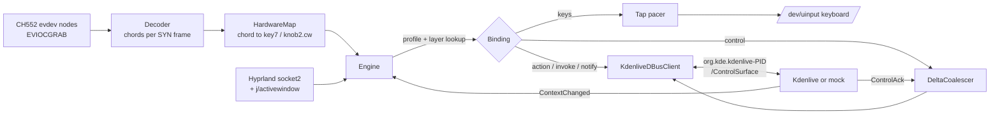

# Daemon design

## Resolution order

For an event on slot `knob1.turn` (or `key5`, `knob2.press`, …):

1. The focused window picks the first profile whose `match` (class/title
   regex) fits. Otherwise the `global` profile applies.
2. In that profile, the first **layer** whose `when` conditions match the
   Kdenlive context and that binds the slot wins. Then the profile's base
   bindings. If the profile has `fallthrough`, the global profile follows.
   `"none"` ends the search.
3. For turns, the slots `knobN.turn` and `knobN.cw`/`ccw` are tried together
   at each level, so a layer's `ccw`/`cw` beats a base `turn`, and an app's
   `cw` beats the global `turn`. Within one level `turn` wins. An explicit
   `"none"` at the winning level stops the search.
4. **Press + turn.** While a knob is held down, a turn first tries
   `knobN.shift.turn` and `knobN.shift.cw`/`ccw` through the same chain. It
   falls back to the plain turn when none is bound. If a knob has any shift
   binding in the current chain, its `press` fires on release, and only if the
   knob did not turn while held. Otherwise `press` fires on the press, as
   before. A pad that reports only taps (down and up together) still gets its
   presses; it just never produces shift turns.

`when` matches dotted paths in the context (`effect.id`, `param.name`,
`focus`, `tool`). Values are exact strings, `/regex/`, `!negation`, lists
(any of) or booleans (present/absent).

Modes (`"modes": {"liftAxis": ["value","r","g","b"]}`) are per profile.
`{"cycle":"liftAxis"}` advances them, and `"$liftAxis"` in control options
expands to the current value. Cycling also calls `Notify` so Kdenlive shows
"Lift: r".

## Latency and flooding

* **Kdenlive controls:** the first detent goes out immediately. Afterwards at
  most one message is in flight per control+options. Further detents are summed
  until `ControlAck` arrives, or 60 ms pass, and never more often than every
  8 ms. Opposite detents cancel. Measured session-bus round trip: p50 ~110 µs,
  p99 ~180 µs. Under a 15 ms/apply busy GUI, 200 detents become fewer than 40
  messages with exact totals.
* **Acceleration** (`accelFactor` for detents closer than `accelWindowMs`)
  applies only to continuous controls and their fallbacks. A binding's own
  `"accel"` overrides `accelFactor`, and 1 turns acceleration off. Discrete
  bindings, e.g. volume keys, stay one per detent.
* **Key taps** are paced at `keyRateHz` (first tap immediate), capped at 48
  queued. Reversing a knob drops queued taps in the old direction.
* A change of focused window (class, pid or address, even with the same
  profile) drops all pending motion. It is never delivered to the next window.
  A late `j/activewindow` answer that a newer focus event made stale is
  discarded.

## Safety

* Device matching: the pad identity `1189:8890` is a compile-time constant
  (`kPadVendor`/`kPadProduct`). A config naming any other vendor/product is
  rejected, and only the serial is configurable. Discovery walks sysfs to the
  USB parent (VID, PID, serial), then checks `EVIOCGID` against the constants on
  the opened node before `EVIOCGRAB`. The uinput keyboard has its own IDs
  (`1d6b:0cf1`, `BUS_VIRTUAL`), so the daemon can never grab it.
* **Kdenlive is API-only by default.** When the interface is absent (no
  service, interface off, the default, or an incompatible revision at
  negotiation), the daemon types nothing into Kdenlive. It sends one notice per
  attachment, to the log and as a desktop notification. Stock shortcuts are
  typed only if the profile sets `"keyFallback": true`, and then only while
  the interface is absent.
  * Never on a domain refusal such as `modal` or `action_disabled`, never on a
    timeout, and never while the answer is still pending.
  * A capability Kdenlive does not advertise is reported, not typed.
  * If an action call proves the interface vanished, the key (opt-in only)
    goes only into the same Kdenlive window (pid and address) that was asked.
  * Stale replies after a re-attach are ignored, and acks are matched on
    (session, seq).

## Configuration lifecycle

* `parseConfig` checks structure: slots, binding forms, regexes, `scale` > 0,
  `accel` ≥ 0, and the pad-only device match. `checkConfig` then reports
  **errors** for references that can never work: undefined modes in `cycle`,
  `$mode` controls or options, and `$mode.<name>` conditions. It reports
  **warnings** for things that may be intended:
  * control and command names this daemon does not know;
  * Kdenlive-only bindings in other profiles;
  * layers without `when`;
  * `keyFallback` outside a Kdenlive profile.

  Messages name the place (`profile kdenlive layer trim knob2.turn`).
* `ConfigWatcher` watches the config file, its directory (for editors that
  save by rename, and files created later) and the learned hardware map.
  After a 300 ms debounce it reloads only if the bytes changed. A valid file
  replaces the engine's config: pending motion is dropped and modes start
  over. An invalid one is logged and notified, and the running config stays.
  Device-match changes need a restart.
* `list-capabilities` (`capabilities.cpp`) uses only read-only members
  (`Capabilities`, `ListActions`, `GetContext`), so it never takes a lease or
  disturbs a running daemon. It relates the answer to the config: which
  layers match now, and which bound controls, commands and actions are not
  offered.
* The virtual keyboard does not advertise power, sleep, wakeup, suspend,
  rfkill, battery or coffee keys, so the kernel drops those codes even if a
  config names them.
* SIGINT/SIGTERM/SIGHUP quit the event loop, so destructors release the grab
  and destroy the uinput device. The kernel also releases a grab when the
  process dies.
* The systemd unit is deliberately unsandboxed. Commands launched by bindings
  are ordinary desktop programs and would inherit restrictions.

## Window backends

* `HyprlandTracker`: `activewindow`/`activewindowv2`/`closewindow`/
  `windowtitlev2` events. Each focus change is followed by one coalesced
  `j/activewindow` query to get the PID. Provisional events carry no stale PID.
  It reconnects every 2 s and picks the newest instance directory if Hyprland
  restarted with a new signature.
* `StaticWindowTracker`: tests, `simulate`, `--force-window`.
* KWin (planned): a tiny KWin script that reports `workspace.activeWindow`
  (resourceClass, caption, pid) to the daemon over D-Bus. The factory switch is
  `createWindowTracker()`.

## FL Studio (future)

The profile exists with key bindings. The planned improvement is a MIDI output
sink (ALSA sequencer port) so knobs can use FL Studio's "Link to controller"
under Wine instead of keystrokes. It would be a new `Binding` kind beside
`keys`/`control`.
