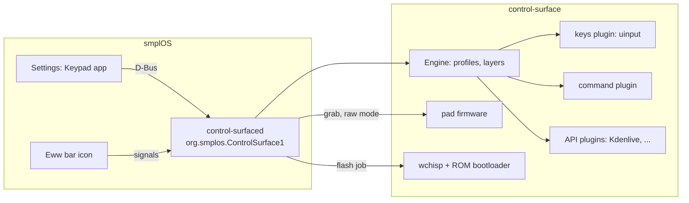

# Generalization plan: the CH552 macro-pad family in smplOS

Goal: smplOS supports the whole family of cheap CH552 macro pads (USB
1189:8890 and look-alikes; 3, 6, 10, 12, 15 or 16 keys; 0 to 3 knobs) with a
Settings "Keypad" app, a bar hot-plug icon, a mapping editor and a firmware
flash wizard. The smplOS session (`smplos` repo) builds the UI; this repository
provides the firmware, the daemon and the daemon's D-Bus service. The two meet
only at the D-Bus API in `docs/dbus-settings-api.md`.

Status: (b) is implemented, with a mock and tests, together with the smplOS
requests R1–R9 (live input, check-config/status/list-actions/features JSON,
mouse bindings, layouts up to 16 keys, any-serial matching, the raw-HID input
backend, startup robustness, firmware releases with firmware-info and
enter-bootloader). (a) beyond this pad and (c) are plans built on what exists.



## (a) Firmware: board profiles and a self-describing layout

### What varies between boards

The 1189:8890 ID is shared by many unrelated boards. Measured so far (this pad,
EpicLPer's 12+3, padclaude's notes, ch57x-keyboard-tool's layouts):

| Aspect | Variants seen |
|---|---|
| MCU | CH552G (SOP-16), CH552T (TSSOP-20), CH57x (different family; out of scope) |
| Key scanning | TM1650 matrix (this pad, EpicLPer), direct GPIO per key (3-key pads), GPIO row/column matrix |
| Keys | 3, 6, 9, 10, 12, 15, 16; often one key on a GPIO next to the matrix |
| Knobs | 0 to 3 encoders, each with a push switch on the matrix or on a GPIO |
| Extras | WS2812 or single LEDs, a layer key, the ROM boot pin wired to a key or not |

The stock firmware cannot be read back and its protocol varies by variant (see
`docs/hardware-ch552.md`), so a board is identified by measuring it, once.

### Board profiles in the firmware

* `firmware/boards/<id>.h` per board: key sources (TM1650 code table, GPIO
  keys, matrix rows and columns), encoder pins and the switch each knob shares,
  LED pins, USB strings, and the slot order. `build.py --board <id>` picks one;
  one image per board, so no flash is spent on unused drivers.
* The pure core (`padlogic.c`, `padstore.c`) takes the slot count and source
  tables from the profile. It already has no board knowledge except the
  key-code table.
* Slots stay "keys row-major, then knob n ccw/press/cw". Up to 16 keys + 3 knobs
  = 25 slots. Data flash (128 B) holds `6 + layers × slots × 2` bytes, so the
  layer count follows from the board: 2 layers for 25 slots, 4 for small pads
  (capped at 4).
* The current board becomes profile `sy181-15k3e` with no behaviour change.

### Identify / layout report

New command `CMD_IDENTIFY` (0x0A), paged, read-only:

| Page | Reply |
|---|---|
| 0 | profile id (ASCII, 8 bytes), rows, columns, key count, knob count, slot count, layer count, feature bits (raw mode, layers, LEDs, GPIO boot key) |
| 1..n | one slot per 3 bytes: kind (key / knob-ccw / knob-press / knob-cw), row, column (knobs: knob index) |

The host then knows the layout without any table of its own. Older firmware
answers `ST_UNKNOWN` (status 6), and the host falls back to the profile named
by the USB product string, then to a profile the user confirms in the wizard.

### Bringing up a new board

1. Photographs and `discovery.bin` (already generic: it reports TM1650 codes
   and changes on every free GPIO) produce a capture.
2. A host tool turns the capture into `boards/<id>.h` plus a layout JSON
   (`firmware/tools/capture2board.py`, to be written).
3. The host tests run against the new table (the suites are table-driven).
4. The board joins the list the flash wizard offers.

### Pads that keep their stock firmware

Where a variant's stock protocol works (ch57x-keyboard-tool's 0x8840/0x8842
style boards), the daemon programs distinct chords, as `ch552-padprog` tried
here, and maps chords to slots with a hardware map. The Settings app shows
these as "stock firmware: keymap mode only". Raw mode, layers in the pad and
the identify report need the open firmware.

## (b) Daemon D-Bus service for the Settings app (implemented)

Session bus, name `org.smplos.ControlSurface`, object `/org/smplos/ControlSurface`,
interface `org.smplos.ControlSurface1`. Full reference: `docs/dbus-settings-api.md`.

| Need | API |
|---|---|
| Presence, firmware type, layout | properties `DevicePresent`, `FirmwareType`; `GetDevice()`, `GetLayout()`, `ListBoardProfiles()`; signal `DeviceChanged` |
| Live input, press to identify | signal `InputEvent(slot, event, delta)` (always); `SetIdentify(on)` suppresses actions; signal `IdentifyChanged`; CLI `control-surfaced monitor --json` |
| Config | `GetConfig()`, `ValidateConfig(text)`, `SetConfig(text, expectedHash)`, `ReloadConfig()`; signals `ConfigChanged`, `ConfigRejected` |
| Plugins | `ListPlugins()`; signal `PluginsChanged` |
| Firmware | `GetFirmwareStatus()`, `StartFlash(image, sha256, dryRun)`, `CancelFlash(job)`; signal `FlashProgress(job, phase, message)` |
| Everything at once | `GetStatus()`; `PropertiesChanged` on every property |

Design rules:

* Structured results are JSON strings with an `ok` field, so shell and Eww
  consumers can use `jq`; simple state is in typed properties.
* **Identify cannot leave the pad muted.** `SetIdentify(true)` suppresses
  actions until `SetIdentify(false)`, until the caller leaves the bus (a
  crashed Settings app), or after 10 minutes (calling it again renews).
  `InputEvent` is published for every input either way.
* **Config writes are safe.** `SetConfig` validates first and refuses on any
  error. It refuses when the file changed since the caller read it
  (`expectedHash`). It keeps the previous file as `<config>.bak` and writes
  atomically. The running config changes only after a successful write, and a
  hand edit is never overwritten.
* **Flashing is opt-in and guarded.** A dry run is always allowed and touches
  nothing. A real flash needs the daemon started with `--allow-flash`. The
  image must be in an allowed directory, at most 14336 bytes, and match the
  caller's SHA-256. The tool arguments are fixed (`wchisp flash IMAGE`; the
  config registers are never written). The daemon releases its grab, waits for
  the user to enter the ROM bootloader (it never forces it), flashes once,
  waits for the pad to return, and grabs again. A cancel is refused while the
  tool is writing.
* The mock (`mock-control-surfaced`) serves the same interface with a
  simulated pad. A second interface, `org.smplos.ControlSurface1.Mock`, lets the
  UI developer plug and unplug the pad, press keys, turn knobs, change plugin
  states and walk the flash wizard, all without hardware.

## (c) Plugins: API tiers

| Tier | Plugin | What a binding does | Status |
|---|---|---|---|
| keys | `keys` | key chords and text through `/dev/uinput` | exists |
| command | `command` | run a program (argv, no shell) | exists |
| api | `kdenlive` | K23 `ControlSurface1` D-Bus contract: context, actions, continuous controls with gestures | exists (as the Kdenlive client) |
| api | later: OBS (websocket), a MIDI bridge for DAWs such as FL Studio under Wine, browsers (MPRIS), ... | | planned |

Today the Kdenlive client is wired into the Engine directly, and `ListPlugins`
reports the three built-ins with live status. The plugin interface below turns
that wiring into a seam, in small steps that the existing tests guard:

```cpp
class ControlPlugin : public QObject {
public:
    virtual QString id() const = 0;                       // "kdenlive"
    virtual QString tier() const = 0;                     // "api"
    virtual bool matches(const WindowInfo &w) const = 0;  // focus routing
    virtual State state() const = 0;                      // available / absent / pending
    virtual QVariantMap context() const = 0;              // for layer conditions
    virtual QJsonObject describe() const = 0;             // controls, commands, actions
    virtual void trigger(const QString &action) = 0;
    virtual bool control(const QString &key, const QString &name, double delta,
                         const QVariantMap &options) = 0; // continuous, coalesced
    virtual void endGestures(bool dropPending) = 0;
Q_SIGNALS:
    void stateChanged();
    void contextChanged(const QVariantMap &ctx);
};
```

* Step 1: `KdenliveClient` implements `ControlPlugin` (it already has every
  method under another name). Profiles say `"plugin": "kdenlive"` instead of
  `"kdenlive": true`; the old key stays accepted.
* Step 2: the Engine routes by plugin id. Coalescing, gestures, epochs and
  acknowledgements stay in the Engine, so every plugin gets the same
  low-latency rules.
* Step 3: out-of-process plugins over D-Bus (`org.smplos.ControlSurface1.Plugin`:
  `Describe`, `Trigger`, `Control`, and a `ContextChanged` signal), so smplOS
  can add plugins in Rust or shell without rebuilding the daemon.
  In-process plugins remain for latency-critical cases.
* The Settings mapping editor lists, per focused app, the plugin's `describe()`
  output (actions with labels, continuous controls with units), and falls back
  to the keys tier for apps without a plugin.

## Order of work

1. Done: firmware 2.0.0 for this pad, the D-Bus service, the mock, the raw-HID
   input backend (report 5, heartbeats, `GET_INFO`), release images, tests.
2. After the user flashes 2.0.0: confirm raw mode on the real pad (§7.8 of
   FIRMWARE-PLAN), then set `verifiedOnHardware` in the release JSON.
3. `CMD_IDENTIFY` and board profiles in the firmware; `GetLayout` reads it.
4. `ControlPlugin` steps 1 and 2.
5. capture2board tool and a second board, when one is available.
