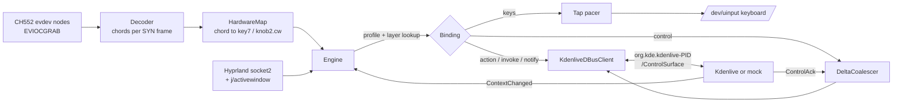

# Daemon design

## Resolution order

For an event on slot `knob1.turn` (or `key5`, `knob2.press`, …):

1. The focused window picks the first profile whose `match` (class/title
   regex) fits. Otherwise the `global` profile applies.
2. In that profile, the first **layer** whose `when` conditions match the
   Kdenlive context and that binds the slot wins. Then the profile's base
   bindings. If the profile has `fallthrough`, the global profile follows.
   `"none"` ends the search.
3. For turns, the slots `knobN.turn` and `knobN.cw`/`ccw` are tried together
   at each level, so a layer's `ccw`/`cw` beats a base `turn`, and an app's
   `cw` beats the global `turn`. Within one level `turn` wins. An explicit
   `"none"` at the winning level stops the search.

`when` matches dotted paths in the context (`effect.id`, `param.name`,
`focus`, `tool`). Values are exact strings, `/regex/`, `!negation`, lists
(any of) or booleans (present/absent).

Modes (`"modes": {"liftAxis": ["luma","r","g","b"]}`) are per profile.
`{"cycle":"liftAxis"}` advances them, and `"$liftAxis"` in control options
expands to the current value. Cycling also calls `Notify` so Kdenlive shows
"Lift: r".

## Latency and flooding

* **Kdenlive controls:** the first detent goes out immediately. Afterwards at
  most one message is in flight per control+options. Further detents are summed
  until `ControlAck` arrives, or 60 ms pass, and never more often than every
  8 ms. Opposite detents cancel. Measured session-bus round trip: p50 ~110 µs,
  p99 ~180 µs. Under a 15 ms/apply busy GUI, 200 detents become fewer than 40
  messages with exact totals.
* **Acceleration** (`accelFactor` for detents closer than `accelWindowMs`)
  applies only to continuous controls and their fallbacks. Discrete bindings,
  e.g. volume keys, stay one per detent.
* **Key taps** are paced at `keyRateHz` (first tap immediate), capped at 48
  queued. Reversing a knob drops queued taps in the old direction.
* A change of focused window (class, pid or address, even with the same
  profile) drops all pending motion. It is never delivered to the next window.
  A late `j/activewindow` answer that a newer focus event made stale is
  discarded.

## Safety

* Device matching: the pad identity `1189:8890` is a compile-time constant
  (`kPadVendor`/`kPadProduct`). A config naming any other vendor/product is
  rejected, and only the serial is configurable. Discovery walks sysfs to the
  USB parent (VID, PID, serial), then checks `EVIOCGID` against the constants on
  the opened node before `EVIOCGRAB`. The uinput keyboard has its own IDs
  (`1d6b:0cf1`, `BUS_VIRTUAL`), so the daemon can never grab it.
* Kdenlive action fallbacks: keys are typed only for a definite "not
  triggered" answer or an absent interface. A timeout never counts, because the
  action may still run late. They also go only into the same Kdenlive window
  (pid and address) that was asked. Stale replies after a re-attach are
  ignored.
* The virtual keyboard does not advertise power, sleep, wakeup, suspend,
  rfkill, battery or coffee keys, so the kernel drops those codes even if a
  config names them.
* SIGINT/SIGTERM/SIGHUP quit the event loop, so destructors release the grab
  and destroy the uinput device. The kernel also releases a grab when the
  process dies.
* The systemd unit is deliberately unsandboxed. Commands launched by bindings
  are ordinary desktop programs and would inherit restrictions.

## Window backends

* `HyprlandTracker`: `activewindow`/`activewindowv2`/`closewindow`/
  `windowtitlev2` events. Each focus change is followed by one coalesced
  `j/activewindow` query to get the PID. Provisional events carry no stale PID.
  It reconnects every 2 s and picks the newest instance directory if Hyprland
  restarted with a new signature.
* `StaticWindowTracker`: tests, `simulate`, `--force-window`.
* KWin (planned): a tiny KWin script that reports `workspace.activeWindow`
  (resourceClass, caption, pid) to the daemon over D-Bus. The factory switch is
  `createWindowTracker()`.

## FL Studio (future)

The profile exists with key bindings. The planned improvement is a MIDI output
sink (ALSA sequencer port) so knobs can use FL Studio's "Link to controller"
under Wine instead of keystrokes. It would be a new `Binding` kind beside
`keys`/`control`.
